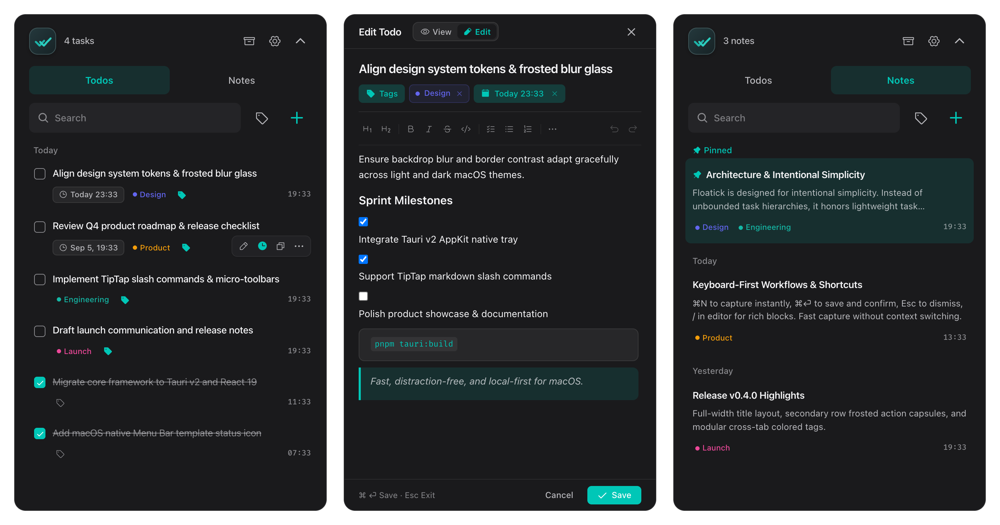

<div align="center">
  <h1>
    
    Floatick
  </h1>
  <p><strong>Lightweight Menu Bar Todos & Notes for macOS</strong></p>
  <p>Capture fast. Finish with focus. Local-first · Fast & Minimal · Open Source</p>
  <p>
    <a href="https://github.com/lucaslus/floatick/actions/workflows/ci.yml">
      
    </a>
    
    
    
    
    
    <a href="./LICENSE">
      
    </a>
  </p>
  <p>
    <strong>English</strong> · <a href="./README.zh-CN.md">简体中文</a>
  </p>
</div>

<p align="center">
  
</p>

Floatick is a lightweight, local-first productivity app crafted natively for macOS. It rests quietly in your Menu Bar with a live counter badge for pending tasks. One click slides open a focused workspace directly beneath the icon. No heavy setups, no cloud sign-ups—just fast capture and effortless follow-through.

## Key Features

- **Menu Bar Native**: Sits quietly in your system status bar with a live pending badge. Click to open directly beneath the tray icon without cluttering your Dock.
- **Full-Width Cards & Floating Capsules**: Task titles span the full row width without premature truncation. Hovering smoothly reveals frosted action capsules (deadline, edit, copy markdown, delete).
- **Separated Browsing & Editing**: Check off tasks instantly in the list; open the full TipTap editor drawer on demand via double-click or `⌘N`.
- **TipTap Markdown & Slash Commands**: Press `/` for interactive checklists, headings, code blocks, and quotes with instant formatting.
- **Deadlines without Noise**: Set due dates directly on task rows. Overdue items stay clearly highlighted without intrusive notification popups.
- **Quick Notes & Shared Tags**: Capture snippets and thoughts grouped by date. Reusable color tags work across both todos and notes.
- **Local-First Privacy**: No accounts, no cloud sync, no tracking. All data is saved as plain, readable JSON in `~/.floatick`.
- **Fast, Lightweight & Native**: Built with Tauri 2 and Rust with a sub-30MB idle footprint, smooth 120Hz animations, and optional launch at login.

## Download & Installation

Download the latest DMG installer from [GitHub Releases](https://github.com/lucaslus/floatick/releases) and drag Floatick to your `Applications` folder. The installer is a Universal Binary supporting both Apple silicon (M-series) and Intel Macs.

> **First-Launch Note for macOS**:
> If macOS displays an "unidentified developer" warning, open **System Settings → Privacy & Security**, scroll down to **Security**, and click **Open Anyway** (only required on first launch).

## Shortcuts & Controls

| Action | Shortcut / Gesture | Description |
| --- | --- | --- |
| **Toggle Window** | Click Menu Bar Icon | Toggle Floatick panel under the status tray |
| **New Item** | `⌘N` | Open editor drawer (Todo or Note) |
| **Edit Item** | Double-click / Hover ✏️ | Open TipTap editor drawer for existing item |
| **Save & Close** | `⌘ ⏎` (Cmd + Enter) | Save current item and close drawer |
| **Close / Dismiss** | `Esc` | Closes active drawer first, then collapses panel |
| **Search Workspace** | `⌘F` | Focus search bar |
| **Switch Tabs** | `Tab` / `⌘1`, `⌘2` | Toggle between Todos and Notes views |
| **Preferences** | `⌘,` | Open Settings drawer (Theme, autostart, pin) |
| **Slash Commands** | Type `/` in editor | Insert task lists, headings, code blocks, quotes |
| **Set Deadline** | Click ⏰ on hover | Open date & time picker directly on row |
| **Copy Markdown** | Click ⎘ on hover | Copy title and content as clean Markdown |
| **Quit Floatick** | Right-click tray / Settings | Quit the application |

## Local Data & Privacy

Floatick automatically creates human-readable JSON files in your home directory on first launch:

| File Path | Purpose |
| --- | --- |
| `~/.floatick/todos.json` | Todos, completion status, deadlines, reminders, and archives |
| `~/.floatick/notes.json` | Notes content, color tags, pinning, and archives |
| `~/.floatick/tags.json` | Reusable color tags shared between todos and notes |
| `~/.floatick/settings.json` | Theme (system/light/dark), language, autostart, and stay-on-top |

Your data never leaves your computer. Floatick operates completely offline and collects zero telemetry.

## Development

### Requirements

- macOS 10.15 or later
- [Node.js](https://nodejs.org/) 18+ and [pnpm](https://pnpm.io/)
- [Rust](https://www.rust-lang.org/) (1.80+) and Cargo

### Local Setup

```bash
# 1. Install dependencies
pnpm install

# 2. Start Tauri development server (with hot reload)
pnpm tauri:dev
```

### Production Build

```bash
# Build Universal Binary DMG and .app bundle
pnpm tauri:build
```

The output files will be created in `src-tauri/target/release/bundle/macos/` and `.../dmg/`.

## Project Structure

```text
src/                          # Frontend (React 19 + TypeScript + Vite + Tailwind CSS)
  components/
    common/                   # TipTap editor, search bar, common UI components
    layout/                   # Header, ContentSwitcher, window frame
    notes/                    # Note list, note rows, note editor drawer
    settings/                 # Preferences drawer (theme, language, autostart)
    tags/                     # Tag management & filtering
    todos/                    # Todo list, item rows, deadline picker, editor drawer
  stores/                     # Zustand state management
  i18n/                       # Localization resources (English and Chinese)
  lib/                        # Tauri IPC API bindings
src-tauri/                    # Native Backend (Rust + Tauri 2.x)
  src/
    tray.rs                   # macOS Menu Bar tray & magnetic window anchoring
    storage.rs                # Atomic JSON file persistence in ~/.floatick
    commands.rs               # IPC commands exposed to frontend
    lib.rs                    # Window lifecycle & auto-dismiss on blur
website/                      # Marketing website (Astro)
docs/                         # Design specifications and architecture guides
```

## License

Floatick is released under the [MIT License](./LICENSE).
