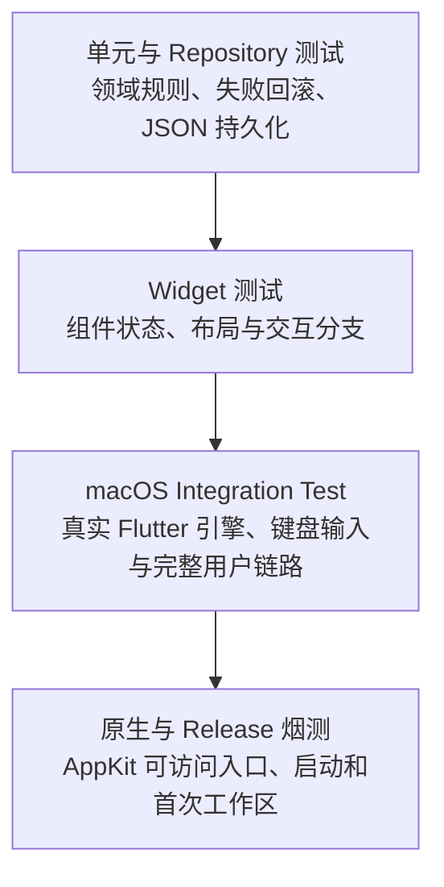

# Floatick 测试指南

Floatick 的自动化测试分为四层。目标不是追求一个模糊的“覆盖率数字”，而是让每一层
验证它最擅长的边界。



## 一键运行 UI 自动化

```bash
tool/test/run_ui_tests.sh
```

该命令会：

1. 在真实 macOS Flutter 引擎上运行 `integration_test/floatick_ui_test.dart`；
2. 使用临时目录隔离数据，不会读写 `~/.floatick`；
3. 运行 AppKit 原生可访问入口测试。

## 当前自动覆盖

| 场景 | 覆盖层 |
| --- | --- |
| 首次启动生成欢迎 Todo 和 Tags | Integration + Release smoke |
| 创建含 Markdown 内容的 Todo | Integration |
| 双击详情、完成、归档、恢复、搜索 | Integration |
| 退出前后的本地 JSON 持久化 | Integration |
| Tag 创建、Todo 关联、多选 OR 筛选和清空 | Integration |
| Notes 切换、创建、标签入口与空草稿处理 | Widget |
| Note 搜索、置顶、归档、恢复、共享标签与失败回滚 | Unit + Widget |
| Sticky Board 创建、添加现有 Todo、Pin/Unpin | Integration |
| 置顶、登录启动、主题等设置与原生调用边界 | Integration |
| 悬浮图标的 macOS Accessibility button/press contract | XCTest |
| Release 应用启动、独立首次工作区和 JSON 有效性 | Release smoke |

普通单元与 Widget 测试仍使用：

```bash
flutter test
```

只运行真实 macOS 用户链路：

```bash
flutter test integration_test/floatick_ui_test.dart -d macos
```

只运行原生边界：

```bash
xcodebuild test \
  -workspace macos/Runner.xcworkspace \
  -scheme Runner \
  -configuration Debug \
  -destination 'platform=macOS' \
  -only-testing:RunnerTests \
  CODE_SIGNING_ALLOWED=NO \
  FLUTTER_TARGET=lib/main.dart
```

## CI

Pull Request CI 会依次执行：

1. 格式与静态检查；
2. 单元和 Widget 测试；
3. macOS UI 自动化与原生边界测试；
4. Universal Release 构建；
5. Release 应用首次启动烟测。

任何一层失败都会阻止合并。

## 必须人工验收的系统边界

Flutter Integration Test 不能操作 macOS 原生系统界面，因此下列行为仍放在 Draft
Release 人工验收中：

- DMG 拖拽安装、Gatekeeper 和“仍要打开”；
- Sparkle 的真实下载、签名验证、替换应用和重启；
- 多显示器上的悬浮图标拖动与展开方向；
- 60/120Hz 动画、滚动和窗口缩放的主观流畅度；
- 真实登录启动以及不同 macOS 版本的窗口层级。

这些项目不是遗漏，而是由操作系统或外部进程控制；自动化负责提前拦截确定性的功能
回归，Draft 验收负责最终用户环境。

## 性能与容量

Todo 列表的数据基准、10,000 条滚动基准、60/120Hz 指标及本地数据库迁移阈值见
[Todo 列表性能与容量方案](TODO_LIST_PERFORMANCE.md)。
