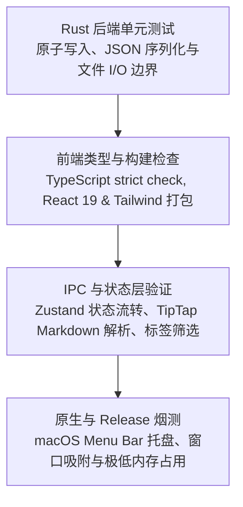

# Floatick 测试指南

Floatick 的自动化与质量保证分为四层。目标不是追求一个模糊的“覆盖率数字”，而是让每一层
验证它最擅长的边界。



## 本地测试命令

### 1. 前端类型检查与生产打包构建

```bash
pnpm build
```

验证所有 React 组件、TipTap 扩展、Zustand store 与 Tailwind CSS 样式均能通过严谨的 TypeScript 检查并正确打包。

### 2. Rust 后端单元测试

```bash
cd src-tauri && cargo test
```

测试 `commands/storage.rs` 的本地原子持久化、临时文件更名、容错降级及默认数据初始化逻辑。

### 3. 开发环境全功能联调

```bash
pnpm tauri:dev
```

在本地直接启动 Tauri 调试窗口，验证 macOS 菜单栏状态图标交互、面板自动滑出定位、TipTap 斜杠命令输入与失焦自动隐藏。

## 场景验证矩阵

| 场景 | 验证层级 |
| --- | --- |
| 首次启动自动初始化 `~/.floatick/` 数据文件与默认标签 | Rust storage test + Smoke test |
| TipTap 编辑器输入 `/` 触发斜杠菜单与 Markdown 解析 | Frontend + Component |
| 待办列表创建、进行中标记、完成、搜索与多标签 OR 筛选 | Zustand Store + UI |
| 笔记列表创建、全屏编辑、置顶、按日期分组与实时保存 | Zustand Store + UI |
| 退出前后的本地 JSON 原子持久化与数据完整性 | Rust Backend + Storage |
| 点击系统菜单栏图标正下方吸附滑出、点击外部失焦自动关闭 | macOS AppKit & Tauri Window |
| 待办未完成数量变动时，实时更新菜单栏图标角标数字 | Rust Tray Manager |
| Release 应用 Universal 架构构建与单进程极低内存占用 | Release smoke test |

## 必须人工验收的系统边界

部分 macOS 深度集成行为仍放在 Release 人工验收中：

- DMG 拖拽安装、首次启动安全校验；
- 菜单栏托盘图标在高分屏（Retina）与多显示器之间的自适应定位；
- 窗口置顶、开机自启系统权限及切换系统明暗外观；
- TipTap 富文本在超长长篇文本下的输入流畅度；
- 窗口打开与收起时的动画平滑度。

